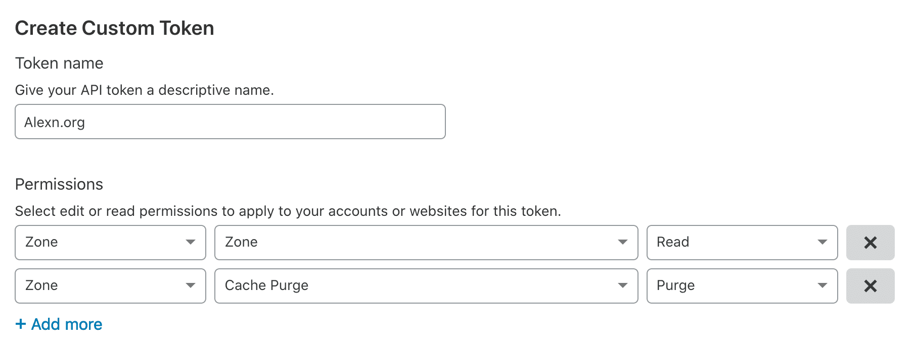

# Cloudflare

## Invalidate cache

Create an API token: 

- go here: [https://dash.cloudflare.com/profile/api-tokens](https://dash.cloudflare.com/profile/api-tokens)
- select permissions: `Zone.Zone (Read)` and `Zone.Cache Purge (Purge)`

Screenshot of how that looks like:



Bash function:

```sh
#!/usr/bin/env bash

cloudflare_invalidate_cache() {
  local DOMAIN_NAME="$1"
  local CF_API_TOKEN="$2"

  if [[ -z "$DOMAIN_NAME" ]]; then
    echo >&2 "ERROR (invalidating cloudflare): DOMAIN_NAME (1) not given!"
    exit 1
  fi

  if [[ -z "$CF_API_TOKEN" ]]; then
    echo >&2 "ERROR (invalidating cloudflare): CF_API_TOKEN (2) is not set!"
    exit 1
  fi

  echo "--- Purging Cloudflare cache for $DOMAIN_NAME"
  
  CF_ZONEID=$(curl -s -X GET "https://api.cloudflare.com/client/v4/zones" -H "Authorization: Bearer $CF_API_TOKEN" -H "Content-Type: application/json" | jq -r '.result[] | "\(.id) \(.name)"' | grep "$DOMAIN_NAME" | cut -f1 -d" ")
  curl -s -X POST "https://api.cloudflare.com/client/v4/zones/$CF_ZONEID/purge_cache" -H "Authorization: Bearer $CF_API_TOKEN" -H "Content-Type: application/json" --data '{"purge_everything":true}' 1>/dev/null
  return 0
}
```

Required tools for this work:

- [jq](https://stedolan.github.io/jq/)
- `curl`, `grep`
