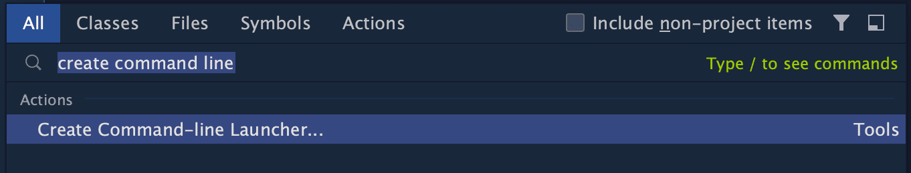
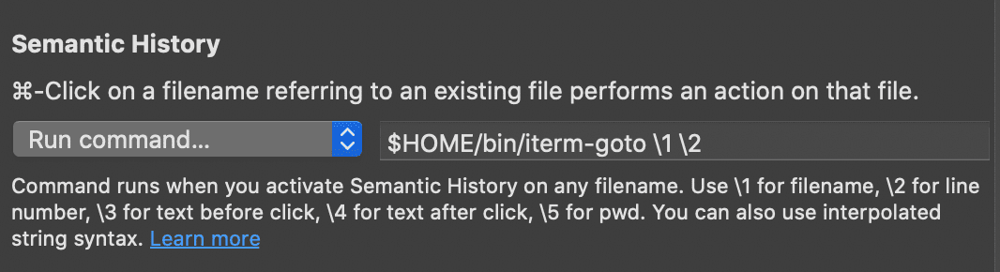

# iTerm2

## Configure opening of file paths (semantic history)

In iTerm's settings, goto `Profiles` -> `Advanced` -> `Semantic
History`.

### Opening files in IntelliJ IDEA + Visual Studio Code

First create IntelliJ IDEA's command line launcher. Press `⇧ Shift + ⇧ Shift` (twice) to bring up the [Navigate -> Search Everywhere](https://www.jetbrains.com/help/idea/searching-everywhere.html#search_all){:target="_blank"} dialog. Then write "*create command-line launcher*" in the search box, to select the desired action, then press `⏎ Enter`:



Now `idea` is installed on the command line, on MacOS this is tipically in `/usr/local/bin/idea`.

Similarly, in [Visual Studio Code](https://code.visualstudio.com/){:target="_blank"} press `⌘ Cmd + P`, type "*install code command*", and press `⏎ Enter`:


The `idea` command line utility isn't compatible with iTerm's settings, plus if we want to discriminate based on file type, an extra script is needed. Save this in `$HOME/bin/iterm-goto`:

``` sh
#!/bin/sh

GOTO_FILE="$1"
GOTO_LINE="$2"
GOTO_CHAR="$3"

if ! [ -f "$GOTO_FILE" ]; then
    echo "ERROR: file path missing or invalid!" >&2
    exit 1
fi

# Discriminate based on file extension, open only .scala or .sbt files in IntelliJ IDEA ...
if [[ "$GOTO_FILE" =~ ^.*\.(scala|sbt)$ ]]; then
    EDITOR_PATH="$(which idea)"

    if [ -z "$IDEA_PATH" ]; then
        EDITOR_PATH="/usr/local/bin/idea"
    fi

    if ! [ -z "$GOTO_LINE" ]; then
        exec "$EDITOR_PATH" --line "$GOTO_LINE" "$GOTO_FILE"
    else
        exec "$EDITOR_PATH" "$GOTO_FILE"
    fi
else
    EDITOR_PATH="$(which code)"

    if [ -z "$EDITOR_PATH" ]; then
        EDITOR_PATH="/usr/local/bin/code"
    fi

    if ! [ -z "$GOTO_CHAR" ]; then
        exec "$EDITOR_PATH" --goto "$GOTO_FILE:$GOTO_LINE:$GOTO_CHAR"
    elif ! [ -z "$GOTO_LINE" ]; then
        exec "$EDITOR_PATH" --goto "$GOTO_FILE:$GOTO_LINE"
    else
        exec "$EDITOR_PATH" "$GOTO_FILE"
    fi
fi
```

Then in iTerm's settings, goto `Profiles` -> `Advanced` -> `Semantic
History`, and set `Run command ...` to:

``` sh
$HOME/bin/iterm-goto \1 \2
```



## Setup automatic dark mode

NOTE: this is intended for the **stable 3.4.x** versions, and isn't needed in the [3.5.x betas](https://iterm2.com/downloads.html).

Create this file in `~/Library/Application\ Support/iTerm2/Scripts/AutoLaunch/auto_dark_mode.py`:

```python
#!/usr/bin/env python3.7

import asyncio
import iterm2

async def changeTheme(connection,parts):
    theme_dark = "Dark Background"
    theme_light = "Light Background"
    print(parts)
    
    if "dark" in parts:
        preset = await iterm2.ColorPreset.async_get(connection, theme_dark)
    else:
        preset = await iterm2.ColorPreset.async_get(connection, theme_light)

    # Update the list of all profiles and iterate over them.
    profiles=await iterm2.PartialProfile.async_query(connection)
    for partial in profiles:
        # Fetch the full profile and then set the color preset in it.
        profile = await partial.async_get_full_profile()
        await profile.async_set_color_preset(preset)

async def main(connection):
    app = await iterm2.async_get_app(connection)
    window = app.current_window
    initial_theme = await app.async_get_theme()
    await changeTheme(connection,initial_theme)

    async with iterm2.VariableMonitor(connection, iterm2.VariableScopes.APP, "effectiveTheme", None) as mon:
        while True:
            # Block until theme changes
            theme = await mon.async_get()
            # Themes have space-delimited attributes, one of which will be light or dark.
            parts = theme.split(" ")
    
            await changeTheme(connection,parts)

iterm2.run_forever(main)
```

Credits: [@FradSer](https://gist.github.com/FradSer/de1ca0989a9d615bd15dc6eaf712eb93).
